<!-- Copyright Amazon.com, Inc. or its affiliates. All Rights Reserved. -->
<!-- SPDX-License-Identifier: MIT-0 -->
# AWS DevOps Agent Demo - Architecture

## System Overview

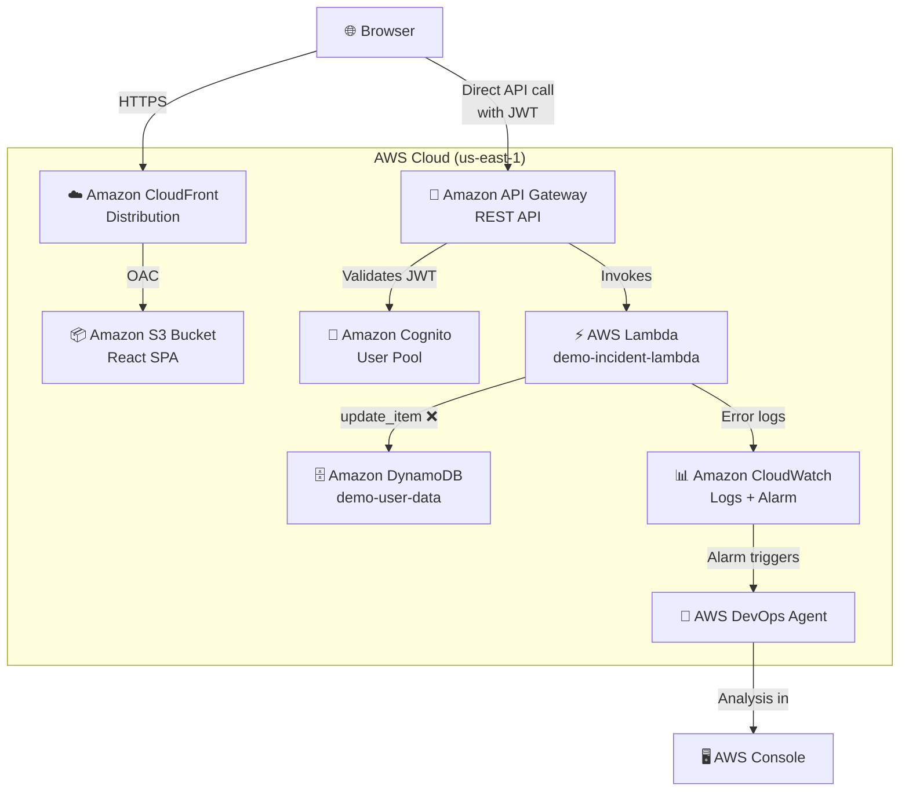

## The Bug Explained

### What's Wrong

The Lambda function uses **`update_item()`** with **`attribute_exists(id)`** condition to store new orders:

```python
# BROKEN CODE (current)
table.update_item(
    Key={'id': order_id},
    UpdateExpression='SET order_data = :data, #s = :status',
    ConditionExpression='attribute_exists(id)',  # ❌ Requires item to exist!
    ExpressionAttributeNames={'#s': 'status'},
    ExpressionAttributeValues={':data': json.dumps(event), ':status': 'processed'},
)
```

### Why It Fails

1. Each order gets a **unique ID** from `context.aws_request_id`
2. This ID has **never been written** to DynamoDB
3. `update_item()` with `attribute_exists()` **requires the item to already exist**
4. Result: **ConditionalCheckFailedException** on every single order

### The Fix

Change to **`put_item()`** for new orders:

```python
# FIXED CODE
table.put_item(
    Item={
        'id': order_id,
        'order_data': json.dumps(event),
        'status': 'processed',
        'created_at': datetime.now().isoformat(),
    }
)
```

### Why This is Realistic

This bug represents a common production error:
- Developer intended to update existing orders
- Forgot that new orders don't exist yet
- Condition check prevents the operation
- 100% failure rate makes it obvious in demo

## Component Details

This section describes each component of the demo and how it is configured.

### Frontend (React + Vite)
- **Technology**: React 18, TypeScript, Tailwind CSS
- **Hosting**: Amazon CloudFront distribution serving static assets from Amazon S3
- **Build Tool**: Vite 4
- **Location**: `portal/frontend/`
- **Configuration**: Runtime injection via `/runtime-config.js` (deployed by CDK AwsCustomResource to S3)
- **Components Used in UI**:
  - ProcessOrderButton - "Process Order" button
  - ResetButton - "Reset Demo" button
  - BusinessDiagram - Customer flow diagram
  - ArchitectureDiagram - AWS technical diagram
  - IncidentBanner - Shows incident status and timer


### Backend API (API Gateway + Lambda)
- **API**: Amazon API Gateway REST API
- **Compute**: AWS Lambda (Python 3.13 runtime)
- **Authentication**: Amazon Cognito User Pool with JWT authorizer
- **CORS**: Configured for the CloudFront origin
- **Location**: `cdk/lib/stacks/api_stack.py`
- **Endpoints**:
  - `POST /process-order` - Process customer order (invokes target Lambda)
  - `GET /alarm-status` - Get CloudWatch Alarm state (polled during incident)

### Authentication (Cognito)
- **Service**: Amazon Cognito User Pool
- **Authorizer**: JWT authorizer on API Gateway
- **Identity Pool**: Federated identity for AWS credential exchange
- **Location**: `cdk/lib/stacks/auth_stack.py`

### Target AWS Lambda
- **Runtime**: Python 3.13
- **Name**: demo-incident-lambda
- **Timeout**: 10 seconds
- **Memory**: 128 MB
- **Environment**: `TABLE_NAME=demo-user-data`
- **Bug**: Uses `update_item()` with `attribute_exists()` condition on new orders
- **Result**: ConditionalCheckFailedException on every order

### AWS DevOps Agent
- **Purpose**: Automated incident detection
- **Capabilities**:
  - Error detection in CloudWatch Logs
  - Multi-service investigation
  - Root cause analysis
  - Displays analysis in AWS Console

## Data Flow

### 1. Error Trigger Flow

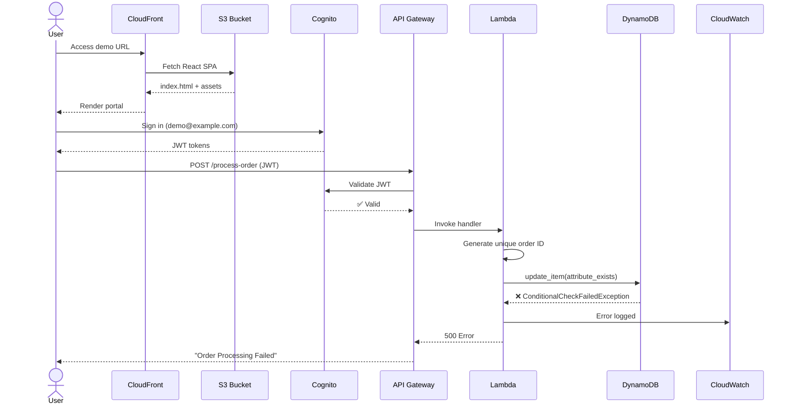

### 2. AWS DevOps Agent Detection Flow

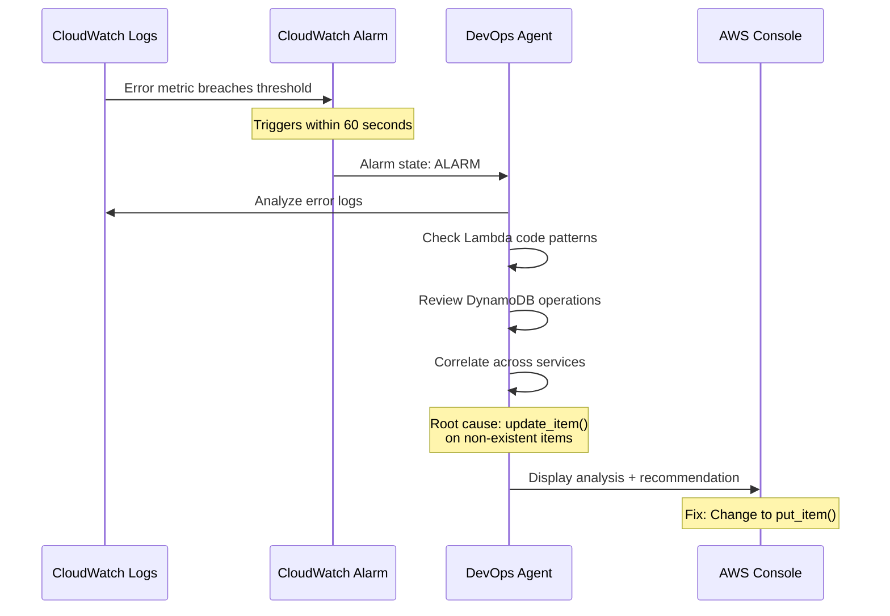

### 3. Manual Fix Flow (Outside Demo Portal)

The demo shows the problem detection. The fix is demonstrated manually:

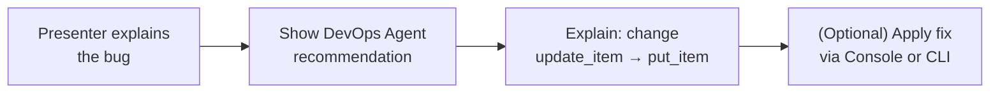

**Note:** The demo focuses on detection and diagnosis, not automated remediation.

### 4. Demo Reset Flow

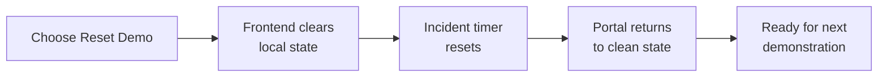

## Deployment Architecture

### CDK Deployment

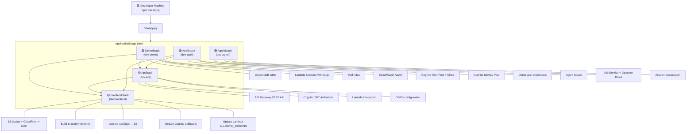

🟢 = independent (no dependencies) · 🟡 = depends on other stacks

### Runtime Architecture

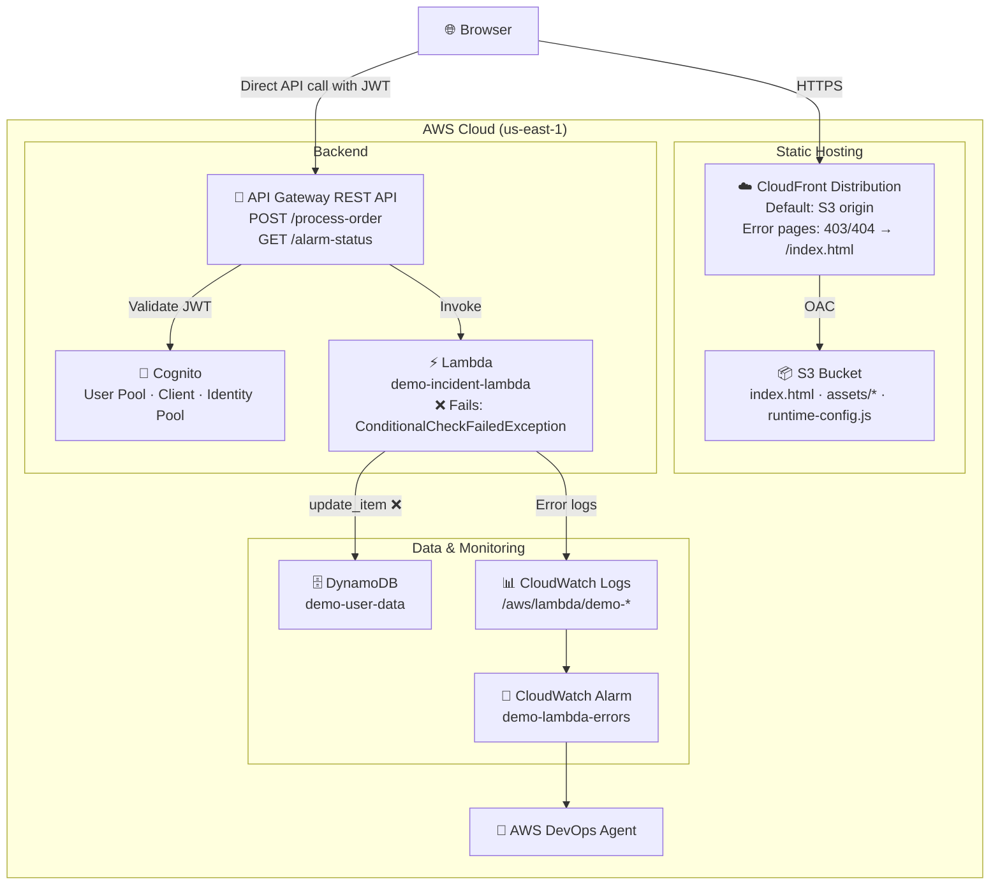


## Security Architecture

> For the full security documentation including threat model, data classification, key management, and shared responsibility model, see [SECURITY.md](SECURITY.md).

### Authentication & Authorization

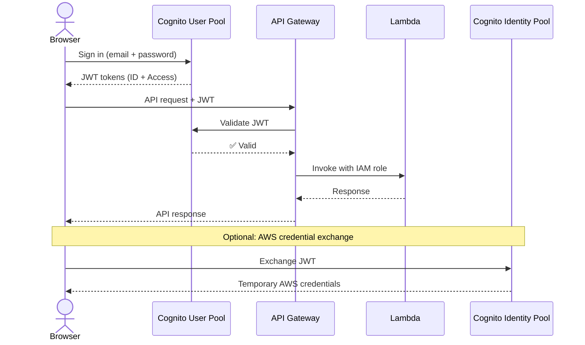

### AWS IAM Permissions

> **Customer Responsibility**: You are responsible for defining and maintaining IAM policies that follow the principle of least privilege. Review and update these policies regularly to verify they grant only the minimum permissions required.

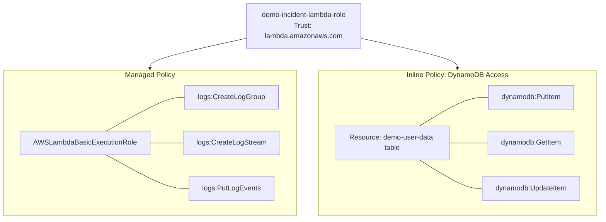

### Network Security

**AWS-managed security**: Lambda execution environment, CloudFront TLS termination, API Gateway DDoS protection.
**Customer-configured security**: API Gateway HTTPS enforcement, S3 bucket access policies, CloudFront distribution settings, CORS origin allowlists.

- **CloudFront**: HTTPS only, TLS 1.2+
- **S3**: Private bucket, accessible only via CloudFront OAC
- **API Gateway**: HTTPS only, Cognito JWT authorization
- **Lambda**: Runs in AWS-managed VPC

## CORS Architecture

The frontend (served from CloudFront) makes cross-origin requests directly to API Gateway. CORS is handled by a three-layer pattern where each layer serves a distinct purpose:

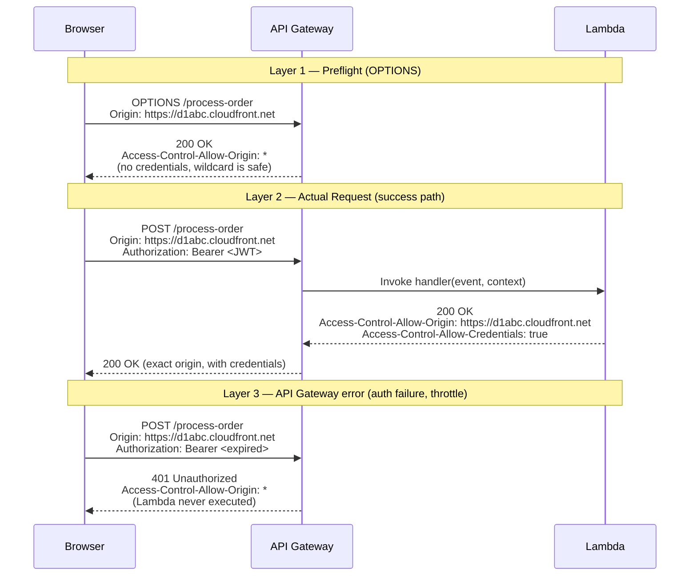

### Why Three Layers?

| Layer | Origin Header | Why |
|-------|--------------|-----|
| Preflight (OPTIONS) | `*` wildcard | CloudFront URL doesn't exist when ApiStack is created (cyclic dependency). Wildcard on preflight is safe per CORS spec — browsers never send credentials on preflight requests. |
| Lambda responses | Exact origin match | The real security enforcement. Lambda reads `ALLOWED_ORIGINS` env var, checks the request's `Origin` header against the list, and returns the exact origin only if it matches. Supports `Access-Control-Allow-Credentials: true`. |
| Gateway error responses (4xx/5xx) | `*` wildcard | When API Gateway rejects a request itself (expired JWT, throttling, malformed request), Lambda never executes and can't set CORS headers. Without wildcard headers on these responses, the browser blocks them entirely and the frontend can't display error messages. Only generic error codes are exposed. |

### Allowed Origins

Origins are configured in two phases during deployment:

1. `ApiStack` creates both Lambdas with an empty `ALLOWED_ORIGINS` (the CloudFront URL does not exist yet at this point)
2. `FrontendStack` updates `ALLOWED_ORIGINS` via `AwsCustomResource` to the CloudFront distribution URL after it's created

At runtime, both Lambdas accept requests only from the CloudFront URL (production). There is no local-development origin.

## Monitoring & Observability

### What Gets Monitored

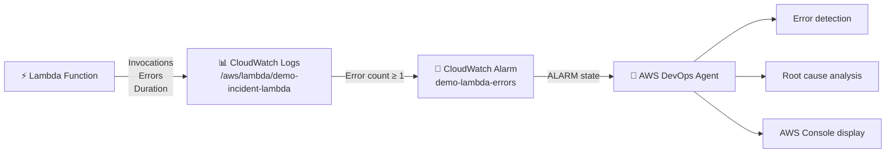

### Logs Location

- **Lambda Logs**: `/aws/lambda/demo-incident-lambda`
- **API Gateway Logs**: `/aws/apigateway/<api-id>` (1 week retention)
- **Frontend Logs**: Browser console

## CDK Stack Dependencies

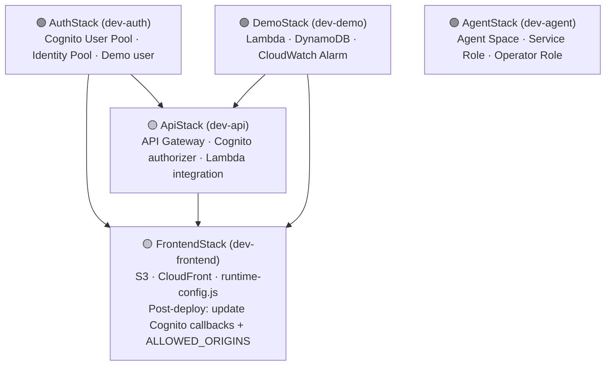

🟢 = independent · 🟡 = has dependencies (arrows show what it depends on)

## Conclusion

This architecture combines Amazon CloudFront and Amazon S3 for static hosting, Amazon API Gateway and AWS Lambda for the backend, Amazon Cognito for authentication, Amazon DynamoDB for storage, and Amazon CloudWatch with AWS DevOps Agent for monitoring and automated incident diagnosis. The intentional `update_item()`/`attribute_exists()` bug gives AWS DevOps Agent a realistic, repeatable failure to detect and diagnose.

Next steps:
- To deploy the demo, see [QUICKSTART.md](./QUICKSTART.md).
- For the security model, threat analysis, and shared responsibility details, see [SECURITY.md](./SECURITY.md).
- For an overview and cost estimates, see [README.md](./README.md).
