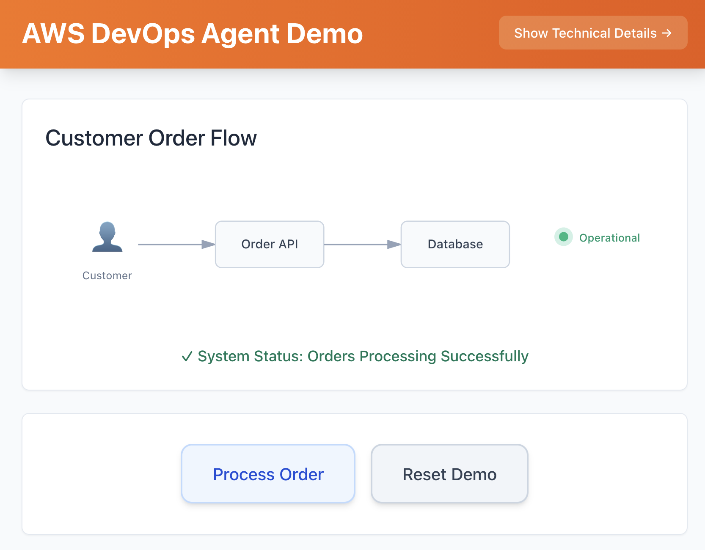
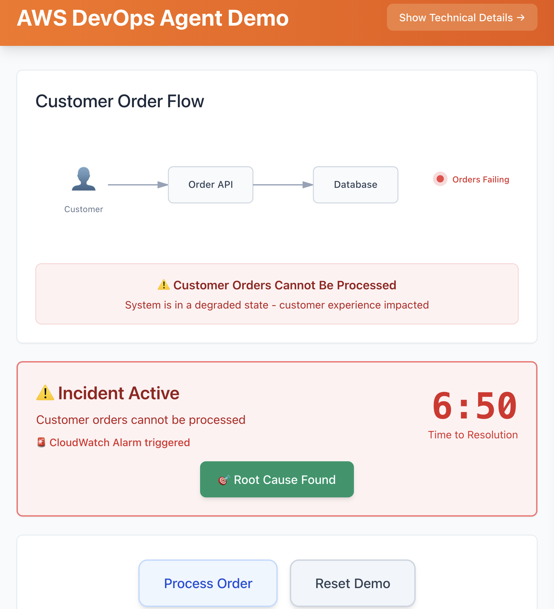
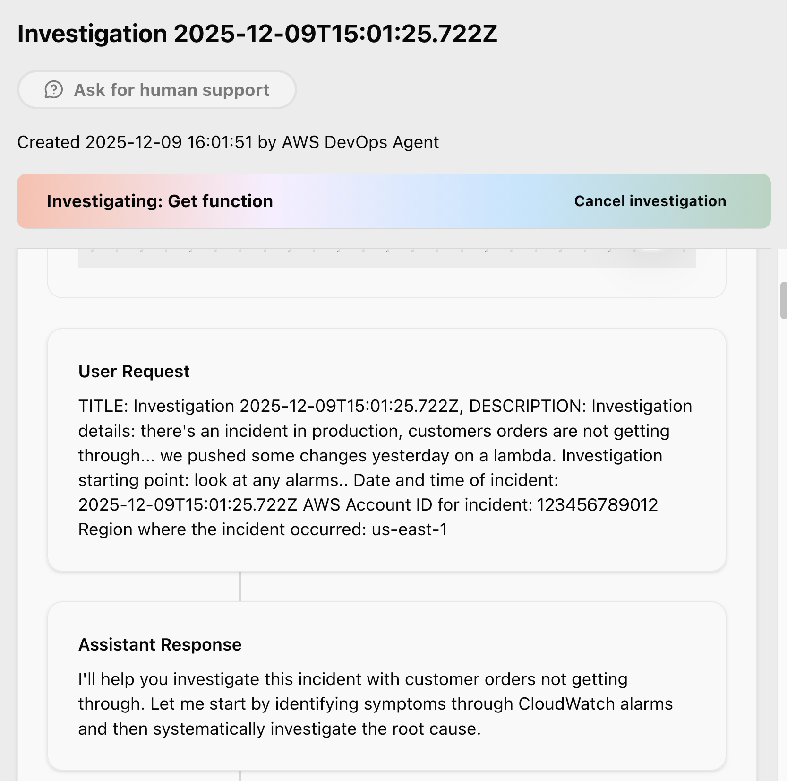
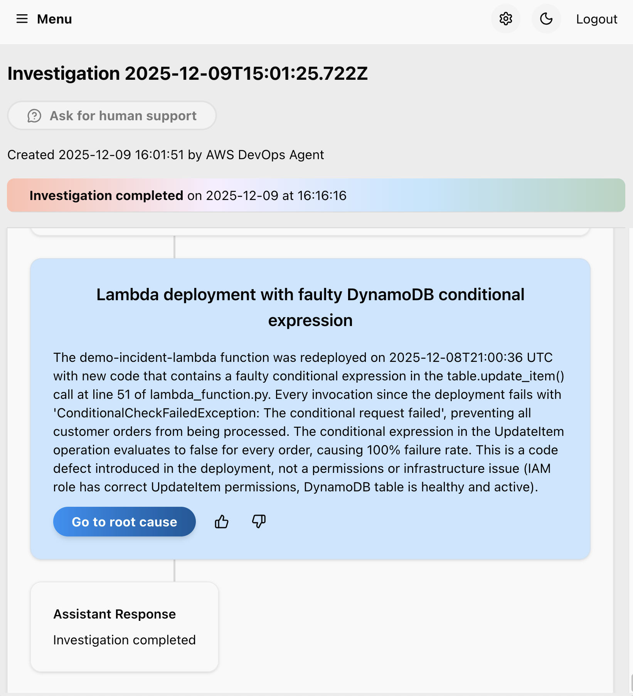

# AWS DevOps Agent — Self-Guided Incident Demo

## High Level Project Summary

A deployable demo that simulates an e-commerce platform with a realistic production bug to showcase how AWS DevOps Agent automatically detects, diagnoses, and recommends fixes for production incidents. Designed for SAs to deploy in their own AWS accounts and present to technical leaders in 10-15 minutes.

> **⚠️ This is sample code, for non-production usage.** It **intentionally contains a bug** (the order Lambda uses `update_item()` with `attribute_exists()` on new orders, so every order fails) to give AWS DevOps Agent a realistic incident to detect and diagnose. Deploy it **only in isolated, ephemeral AWS accounts** and tear it down after use (`npm run cleanup`). Do not use it in production or with production data. Work with your security and legal teams to meet your organizational security, regulatory, and compliance requirements before deployment. See [SECURITY.md](./SECURITY.md) for details.

## Demo Screenshots

<table>
  <caption>Demo portal screenshots showing four stages of the incident workflow</caption>
  <thead>
    <tr>
      <th scope="col">Stage</th>
      <th scope="col">Screenshot</th>
    </tr>
  </thead>
  <tbody>
    <tr>
      <td><b>1. Business View - Clean Interface</b></td>
      <td></td>
    </tr>
    <tr>
      <td><b>2. Incident Active - Timer Running</b></td>
      <td></td>
    </tr>
    <tr>
      <td><b>3. Investigation Starting</b></td>
      <td></td>
    </tr>
    <tr>
      <td><b>4. Root Cause Found - Resolution Complete</b></td>
      <td></td>
    </tr>
  </tbody>
</table>

## Relevant Documentation

- **[QUICKSTART.md](./QUICKSTART.md)** - Detailed setup and troubleshooting
- **[ARCHITECTURE.md](./ARCHITECTURE.md)** - Technical architecture, data flows, security model

## Solution Components

The demo consists of five CDK stacks deployed as a single stage (`dev`):

### Demo Stack (`dev-demo`)
AWS Lambda function with intentional bug, Amazon DynamoDB table for order storage, and Amazon CloudWatch Alarm for error detection. The Lambda uses `update_item()` with `attribute_exists()` on new orders, causing 100% failure rate — this is the bug that AWS DevOps Agent diagnoses.

### Auth Stack (`dev-auth`)
Amazon Cognito User Pool with email sign-in, Identity Pool, AWS WAF protection with rate limiting and managed rules. Auto-creates a demo user at deployment time.

### API Stack (`dev-api`)
Amazon API Gateway REST API with Amazon Cognito authorizer, AWS Lambda integrations for order processing and alarm status, CORS configuration, and request throttling (10 rps).

### Frontend Stack (`dev-frontend`)
Amazon S3 bucket with Amazon CloudFront distribution serving the React app. Deploys runtime config (Amazon Cognito/API settings) to S3 and updates AWS Lambda CORS origins with the CloudFront URL.

### Agent Stack (`dev-agent`)
AWS DevOps Agent Space with an AWS IAM service role and account association. Enables AI-powered incident detection and diagnosis of the demo resources.

### Architecture Diagram

See [ARCHITECTURE.md](./ARCHITECTURE.md) for detailed diagrams including CDK stack dependencies, runtime architecture, and error detection flow.

```
Customer → Amazon CloudFront → Amazon S3 (React App)
                             → Amazon API Gateway → AWS Lambda → Amazon DynamoDB
                                                              → Amazon CloudWatch Alarm → AWS DevOps Agent
```

## Useful Commands

```bash
npm run install:all    # Install all dependencies
npm run setup          # Deploy all stacks via CDK
npm run verify         # Verify deployment
npm run cleanup        # Destroy all AWS resources
npm run build:frontend # Build frontend for production
npm run cdk:diff       # Preview infrastructure changes
npm run cdk:synth      # Generate CloudFormation templates
```

### Manual CDK Commands

```bash
cd cdk
source .venv/bin/activate
cdk deploy "dev/**"                 # Deploy all stacks
cdk deploy "dev/frontend"           # Deploy frontend only
cdk destroy "dev/agent" --force     # Remove agent stack
```

## Setup

### Solution Prerequisites

- AWS CLI configured (`aws configure`)
- Python 3.13 recommended (3.10 minimum)
- Node.js 22+
- AWS CDK CLI (`npm install -g aws-cdk@2.1126.0`)
- CDK bootstrapped in your account (`cdk bootstrap`)
- Region: **us-east-1** (this demo is configured for and deploys to us-east-1; the agent stack enforces it)

### Deploy

```bash
npm run install:all    # Install dependencies
npm run setup          # Deploy all stacks
npm run verify         # Verify deployment
```

Open the CloudFront URL from the CDK output to access the demo portal.

**Login Credentials:**
- Email: `demo@example.com`
- Password: Check the `DemoPassword` output from `cdk deploy` or the `dev-auth` stack in CloudFormation console

### Additional Setup Instructions

#### Configure DevOps Agent Web App

The Agent Stack deploys automatically with `npm run setup`. To enable the Operator Web App:

1. Navigate to the AWS DevOps Agent console in us-east-1
2. Go to your Agent Space
3. Choose the **Web app** tab
4. Under "Operator access", select **Assign an existing role**
5. Enter the `OperatorRoleArn` from your stack outputs
6. Choose **Configure web app**

**Important:** If your IAM Identity Center is in a different region (e.g., eu-central-1), you MUST use the "Assign an existing role" option. The auto-create option only works when IAM Identity Center is in us-east-1.

**Resource Discovery:** AWS DevOps Agent automatically discovers demo resources through CloudFormation stack scanning — no manual configuration needed.

**Triggering Investigations:** Can be started manually from the Operator Web App (used in this demo) or automatically via [webhook configuration](https://docs.aws.amazon.com/devopsagent/latest/userguide/configuring-capabilities-for-aws-devops-agent.html).

For more details, see the [AWS DevOps Agent Getting Started Guide](https://docs.aws.amazon.com/devopsagent/latest/userguide/getting-started-with-aws-devops-agent.html).

### Making Changes

- **Frontend**: Edit files in `portal/frontend/src/`, then redeploy with `cdk deploy "dev/frontend"`
- **Lambda**: Edit `src/lambda_function.py`, then redeploy with `cdk deploy "dev/demo"`
- **Infrastructure**: Edit stacks in `cdk/lib/stacks/`, then `cdk deploy "dev/**"`

### Cleanup

**Note**: This command destroys all AWS resources and data created by the demo. Run it when you finish using the demo.

This destroys:
- All CDK stacks (`dev-demo`, `dev-auth`, `dev-api`, `dev-frontend`, `dev-agent`)
- The Amazon CloudFront distribution
- The Amazon S3 bucket with all frontend assets
- The Amazon API Gateway REST API
- AWS Lambda functions, Amazon CloudWatch alarms, and logs
- The Amazon DynamoDB table with all order data
- Amazon Cognito user and identity pools
- The AWS WAF web ACL protecting the Cognito user pool
- The AWS DevOps Agent Space with its service and operator roles
- AWS IAM roles (`demo-incident-lambda-role` and the AWS DevOps Agent roles)

```bash
npm run cleanup        # Destroys all stacks and resources
```

## Running the Demo

Run through these steps to present the incident lifecycle:

1. Choose **Process Order** in the portal.
2. Verify the order fails.
3. Verify the incident timer starts.
4. Wait approximately 60 seconds for the Amazon CloudWatch Alarm to evaluate.
5. Verify the alarm status appears in the portal.
6. Open the AWS DevOps Agent console.
7. Create an investigation using the prompt below.
8. When the agent reports the root cause, choose **Root Cause Found**.
9. Verify the timer stops.
10. Verify the resolution time is displayed.
11. Choose **Reset Demo** to return to a clean state.

### Investigation Prompt

When creating the investigation in the DevOps Agent console, use the following (replacing `123456789012` with your own account ID):

> Customer orders cannot be processed, impacting production. No orders are coming through. This happened in account `123456789012`, us-east-1.
>
> The order processing system is lambda based, I believe a CloudWatch alarm has just been raised.

Once the investigation starts, you can steer it via the chatbot:

> Focus on the essentials, this is impacting production.

### Pre-Demo Checklist

```bash
npm run verify         # Check all stacks are deployed
```

- ✅ Portal loads, login works
- ✅ "Process Order" fails and timer starts
- ✅ CloudWatch alarm fires within ~60s
- ✅ Agent Space shows discovered resources

**Tip:** Run a test investigation the day before to warm up the agent.

**The demo focuses on problem detection and diagnosis, not automated fixes.**

## Cost

| Service | Estimated Cost |
|---|---|
| Lambda | Free tier |
| DynamoDB | Free tier (on-demand) |
| CloudWatch | Free tier (logs + 1 alarm) |
| CloudFront | Free tier (1TB transfer/month) |
| Cognito | Free tier (50,000 MAUs) |
| API Gateway | Free tier (1M calls/month) |
| AWS DevOps Agent | $0.0083/agent-second (~$4 per 8-min investigation) |
| **Total** | **< $1/month + DevOps Agent usage** |

> **Note**: AWS DevOps Agent is billed per second of active agent time (not idle time). A typical demo investigation costs ~$4. Tear down the agent stack (`cdk destroy "dev/agent"`) when not demoing. See [pricing](https://aws.amazon.com/devops-agent/pricing/) for details.

## Project Structure

```
aws-devops-agent-demo/
├── src/lambda_function.py          # Lambda with intentional bug
├── portal/frontend/                # React demo UI (CloudFront + S3)
├── cdk/
│   ├── app.py                      # CDK entry point
│   ├── lib/
│   │   ├── stage.py                # Stage wiring (all stacks)
│   │   ├── stacks/
│   │   │   ├── demo_stack.py       # Lambda + DynamoDB + Alarm
│   │   │   ├── auth_stack.py       # Cognito authentication
│   │   │   ├── api_stack.py        # API Gateway
│   │   │   ├── frontend_stack.py   # CloudFront + S3
│   │   │   └── agent_stack.py      # DevOps Agent Space
│   │   └── common/                 # Shared constructs
│   └── requirements.txt
├── scripts/verify_setup.sh         # Deployment verification
├── QUICKSTART.md                   # Setup guide
└── ARCHITECTURE.md                 # Technical architecture
```

## Troubleshooting

See [QUICKSTART.md](./QUICKSTART.md#troubleshooting) for detailed troubleshooting steps.

## Conclusion

This demo showcases how AWS DevOps Agent detects, diagnoses, and recommends fixes for a realistic production incident. In this demo scenario, automated diagnosis takes roughly 10 minutes versus a manual investigation that can run 30-60 minutes (illustrative figures for this demo; actual results vary by incident and environment). It runs on a serverless stack (Amazon CloudFront, Amazon S3, Amazon API Gateway, AWS Lambda, Amazon Cognito, Amazon DynamoDB, and Amazon CloudWatch) that you can deploy and tear down in an isolated account in minutes.

Ready to try it? See [QUICKSTART.md](./QUICKSTART.md) to deploy, and [ARCHITECTURE.md](./ARCHITECTURE.md) for the technical details and security model.

## License

MIT-0
